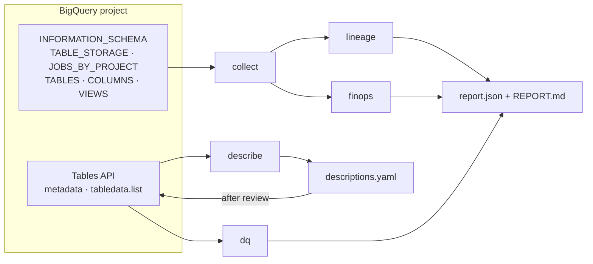

# BigQuery Governance & FinOps Toolkit

Know what is in a BigQuery project, what it costs, who uses it, what depends on what, and whether the data is healthy, using only
metadata (`INFORMATION_SCHEMA` and the Tables API) and a strict per-query byte limit.

`bqgov run` produces one JSON report (for dashboards) and one Markdown report (for people) covering:

| Area | What you get |
|---|---|
| **Storage** | Logical size, active vs long-term bytes and estimated monthly cost per table |
| **Query cost** | Estimated on-demand cost by user, day, statement type, pipeline label, and normalized query pattern; most expensive jobs |
| **Usage** | Reads per table, readers, full scans, columns used in filters, `SELECT *` usage, last read |
| **Recommendations** | Partition, cluster, avoid `SELECT *`, and unused tables, each with the evidence and the cost it addresses |
| **Lineage** | Table-to-table edges from write jobs and view definitions, with downstream impact per table |
| **Data dictionary** | Every column with type, description, partitioning and clustering; documentation coverage |
| **Data quality** | Freshness, row count, row-count change, null rate and duplicate keys, graded pass / warn / fail |
| **AI descriptions** | LLM-suggested table and column descriptions, written to a file for human review before anything is applied |

Sample output: [docs/sample-report.md](docs/sample-report.md) (generated from the synthetic test fixtures).

## How it works



## Cost guards

A governance tool that runs up the bill defeats its purpose, so every path is bounded:

- **Every query has `maximum_bytes_billed`** (default 1 GiB). A query over the limit is rejected by BigQuery before it is billed.
- **Data quality profiling runs a dry run first** and is skipped (reported as a warning) if the scan would exceed the limit.
- **Free paths wherever possible:** row counts, freshness and schema come from the Tables API; sample values for AI descriptions come
  from `tabledata.list`, because `SELECT ... LIMIT 5` still bills a full column scan.
- **The toolkit's own jobs are labelled `tool=bqgov`** and excluded from the analysis; their bytes are reported separately.
- Parent `SCRIPT` jobs are excluded from cost so script costs are not counted twice.

## Recommendations: rules and evidence

| Type | Raised when | Reported evidence |
|---|---|---|
| `partition` | Table above `partition_min_gib`, not partitioned, ≥ 3 full scans in the window, and a DATE/TIMESTAMP column appears in filters | full scans, the filtered column, and the cost of those scans; proposed DDL |
| `cluster` | Table above `cluster_min_gib`, not clustered, and up to 4 non-date columns filtered in ≥ 3 queries | columns with filter counts, the read cost |
| `select_star` | ≥ 3 `SELECT *` queries on a table with ≥ 10 columns | query count and their cost |
| `unused` | Base table in a catalogued dataset with no reads in the window | monthly storage cost; owner review before any `DROP` |

"Addressable cost" is the cost the change could reduce, not a promised saving: the actual saving depends on how selective the
filters are. A full scan is a single-table job that processed at least `full_scan_ratio` (default 90%) of the table's logical size.

## AI-suggested descriptions, with a review gate

`bqgov describe` asks an LLM (Gemini or a local Ollama model) for table and column descriptions and writes them to `descriptions.yaml`.
Nothing changes in BigQuery until a person sets `reviewed: true` and runs `bqgov describe --apply`. The model sees column names, types and
at most five sample rows with emails and phone numbers masked; existing descriptions are never overwritten.

## Quickstart

Works in the **BigQuery sandbox** (no credit card): 1 TiB of queries per month, 10 GiB of storage. The sandbox does not allow DML and
expires tables after 60 days, so the demo uses `CREATE TABLE AS SELECT` only and the toolkit writes its history to files, not tables.

```bash
pip install -e ".[dev]"                 # add [ai] for describe
gcloud auth application-default login
# 1. create the demo warehouse (< 100 MB, from bigquery-public-data.thelook_ecommerce, no PII columns)
bqgov demo-sql > /tmp/setup.sql          # run it in the BigQuery console, or: bq query --use_legacy_sql=false < /tmp/setup.sql
# 2. generate job history: pipeline rebuilds plus analyst queries (~1 GB per round)
python demo/workload.py --project YOUR_PROJECT --rounds 2
# 3. configure and run
cp config.example.yaml config.yaml       # set project
bqgov -v run                             # writes snapshots/report-YYYY-MM-DD.json, latest.json, REPORT.md
```

Step-by-step guide in Indonesian: [docs/SETUP_ID.md](docs/SETUP_ID.md). Tests run offline against fixtures: `pytest`.

**Permissions** for the identity running it: BigQuery Job User (run queries), Resource Viewer (`bigquery.jobs.listAll`, needed for
`JOBS_BY_PROJECT`), Metadata Viewer (storage and schemas), and Data Viewer on datasets with DQ checks. `describe --apply` also needs
Data Editor on the datasets it documents.

Published reports replace every email with a stable `user-xxxxxx` id (`publish.redact_users`, on by default).

## Limitations

- Costs are **on-demand estimates from list prices**, not a billing export. Projects on capacity (editions/reservations) pay per slot;
  slot-based cost is not modelled yet.
- Filter columns are detected with a regular expression over query text. It handles typical `WHERE` predicates, not every SQL form.
- Lineage covers jobs inside the lookback window and current view definitions; `JOBS_BY_PROJECT` keeps 180 days of history.
- The demo is deliberately small, so its dollar amounts are fractions of a cent; the method is the same at any scale.

## Background

A re-implementation, on public data, of governance and cost tooling I built for a large telecom BigQuery environment (30+ projects,
20,000+ tables). No employer code, data, or configuration is included.

## License

MIT
